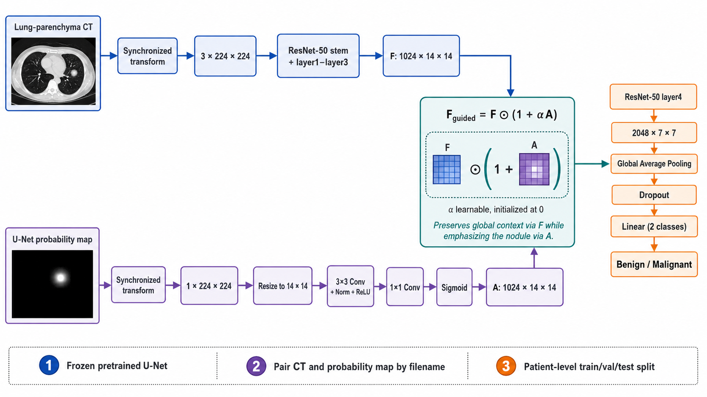

# Segmentation-guided ResNet-50

Model ini mempertahankan konfigurasi full fine-tuning dan 5-fold CV dari
`fulltuning_cv_resnet50`, lalu menambahkan U-Net probability map sebagai
residual multiplicative attention setelah ResNet `layer3`:



```text
CT (3x224x224) -> ResNet stem/layer1-3 -> F (1024x14x14) ----(*)----> layer4 -> GAP -> classifier
                                                         /    |
Probability map -> resize -> Conv3x3 -> Conv1x1 -> sigmoid     |
                              A (1024x14x14)             F * (1 + alpha*A)
```

`alpha` dipelajari dan diinisialisasi ke nol. Dengan demikian, model dimulai
sebagai ResNet-50 biasa dan belajar seberapa kuat probability map perlu
memandu fitur. CT dan probability map menerima transform geometris yang sama;
augmentasi intensitas hanya diterapkan pada CT. Interpolasi linear dipakai
untuk mempertahankan nilai probability map yang kontinu.

Setiap fold dijalankan maksimal 100 epoch dengan early stopping berdasarkan
`val_loss`. Training fold dihentikan setelah 20 epoch berturut-turut tanpa
penurunan `val_loss`, kemudian bobot dari epoch terbaik dimuat kembali untuk
evaluasi dan pembuatan prediksi validation.

## Data

Tersedia tiga profil input yang menggunakan pipeline dan hyperparameter yang
sama:

| Profil | UUID eksperimen | Kolom CT |
|---|---|---|
| `windowed` | `dc730a13-5813-4d87-b15c-3b630deb32b5` | `ct_windowed_path` |
| `parenchyma` | `242d4058-fee2-47cb-b1f2-6608348300f5` | `ct_parenchyma_path` |
| `windowed_v2_0877` | `0877cfde-8744-4aaf-909b-7f906a240117` | `ct_windowed_path` |

Profil `windowed` dan `parenchyma` membaca metadata
`000_dataset/_segmentation_dataset_v2/004_classification_cv_5fold_seed42.csv`,
sedangkan `windowed_v2_0877` membaca
`000_dataset_v2/_segmentation_dataset/004_classification_cv_5fold_seed42.csv`.
Probability map harus berasal dari UUID eksperimen yang sama dan berada di
`experiment_results/<experiment_id>/segmentation/unet/inference/probability_npy`.
Ground-truth mask juga divalidasi sebelum training agar data untuk evaluasi dan
visualisasi tersedia sejak awal.

Nama setiap probability `.npy` harus sama dengan kolom `filename`. Dataset
memvalidasi keberadaan semua pasangan, dimensi array, nilai finite, dan rentang
probabilitas `[0, 1]` sebelum training/inference. Resolusi awal CT dan
probability map boleh berbeda; keduanya di-resize langsung ke `224 x 224`
oleh transform berpasangan sebelum augmentasi geometris berikutnya.

## Konfigurasi

Konfigurasi profil eksplisit berada di:

```text
003_classification/configs/
├── segmentation_guided_cv_resnet50_windowed.json
├── segmentation_guided_cv_resnet50_parenchyma.json
└── segmentation_guided_cv_resnet50_windowed_v2_0877.json
```

Setiap file mengikat UUID, `ct_input_type`, `ct_path_column`, dan probability
map yang sesuai. `train.py` memvalidasi bahwa `windowed` selalu menggunakan
`ct_windowed_path`, sedangkan `parenchyma` selalu menggunakan
`ct_parenchyma_path`. Konfigurasi lama tanpa `ct_input_type` tetap didukung
dengan menurunkan tipe input dari nama kolom CT.

Saat training dimulai, file JSON yang efektif disalin ke:

```text
experiment_results/<experiment_id>/classification/guided_resnet50/
    └── segmentation_guided_cv_resnet50.json
```

File ini adalah snapshot input konfigurasi. `cv_config.json` dan
`fold_<n>/training_config.json` tetap dibuat sebagai provenance runtime yang
lebih terperinci, termasuk distribusi data, path output, dan UUID run internal.

## Menjalankan

Jalankan profil full-area windowed dari root repository:

```bash
conda run -n deep_learning python \
  -m 003_classification.segmentation_guided_cv_resnet50.train \
  --config 003_classification/configs/segmentation_guided_cv_resnet50_windowed.json
```

Jalankan profil lung parenchyma:

```bash
conda run -n deep_learning python \
  -m 003_classification.segmentation_guided_cv_resnet50.train \
  --config 003_classification/configs/segmentation_guided_cv_resnet50_parenchyma.json
```

Jalankan profil windowed dengan layout dataset LIDC/LNDb terpisah:

```bash
conda run -n deep_learning python \
  -m 003_classification.segmentation_guided_cv_resnet50.train \
  --config 003_classification/configs/segmentation_guided_cv_resnet50_windowed_v2_0877.json
```

Hasil U-Net dan guided classification selalu disatukan di bawah UUID yang
tercatat dalam konfigurasi:

```text
experiment_results/dc730a13-5813-4d87-b15c-3b630deb32b5/
├── segmentation/unet/
└── classification/guided_resnet50/
```

Gunakan UUID baru di file profil jika hendak memulai eksperimen baru. Training
tidak akan menimpa direktori guided classification yang sudah ada. File JSON
yang dipilih melalui `--config` disalin sebagai snapshot efektif; nilai input
yang sama juga dicatat di `cv_config.json` dan setiap
`fold_<n>/training_config.json`.

Setelah kelima fold selesai, gunakan komponen guided classification pada
experiment UUID yang sama:

```bash
conda run -n deep_learning python -m pip install -r 003_classification/segmentation_guided_cv_resnet50/requirements.txt

# Windowed run
conda run -n deep_learning python \
  -m 003_classification.segmentation_guided_cv_resnet50.test \
  experiment_results/dc730a13-5813-4d87-b15c-3b630deb32b5/classification/guided_resnet50

# Parenchyma run
conda run -n deep_learning python \
  -m 003_classification.segmentation_guided_cv_resnet50.test \
  experiment_results/242d4058-fee2-47cb-b1f2-6608348300f5/classification/guided_resnet50
```

Tanpa argumen, `test.py` menggunakan hasil Colab yang ditempatkan di
`experiment_results/dc730a13-5813-4d87-b15c-3b630deb32b5/classification/guided_resnet50`.
`test.py` membaca tipe CT dari snapshot run sehingga pilihan input tidak perlu
diberikan kembali saat testing. Direktori hasil CV lain masih dapat diberikan
sebagai argumen positional.
Path absolut `/content/...` yang tersimpan di konfigurasi Colab otomatis
dipetakan ke dataset dan probability map lokal tanpa mengubah provenance
konfigurasi asli.

`test.py` melakukan ensemble atas lima model fold pada holdout test dan
menyimpan prediksi, metrik, confusion matrix, ROC, serta Grad-CAM dan LRP dalam
`<result_dir>/test/`. LRP menggunakan Zennit `EpsilonPlusFlat` dengan
`ResNetCanonizer` dan menjelaskan kanal CT dengan probability map yang dibuat
tetap untuk sampel tersebut.

Struktur utama hasil test:

```text
test/
├── gradcam_npy/               # Grad-CAM per slice pada ruang input model
├── lrp_npy/                   # LRP per slice pada ruang input model
├── visualization/             # satu PNG per study, section per nodule
├── test_predictions.csv
├── test_results.json
├── confusion_matrix.*
└── roc_curve.png
```

Setiap baris slice pada section nodule menampilkan CT sesuai profil training,
ground-truth nodule mask, probability heatmap U-Net, Grad-CAM overlay, dan LRP
overlay. Grad-CAM dan LRP di-resize ke grid CT asli hanya untuk visualisasi;
array `.npy` tetap disimpan pada resolusi input model.

## Catatan validasi

Untuk estimasi CV yang benar-benar bebas kebocoran, probability map pada fold
validasi sebaiknya dihasilkan oleh U-Net yang tidak pernah dilatih memakai
pasien pada fold tersebut (out-of-fold segmentation). Run U-Net default di
atas tetap dipakai sesuai konfigurasi yang diminta, tetapi provenance split
segmentasinya perlu diperhitungkan ketika melaporkan hasil eksperimen.
